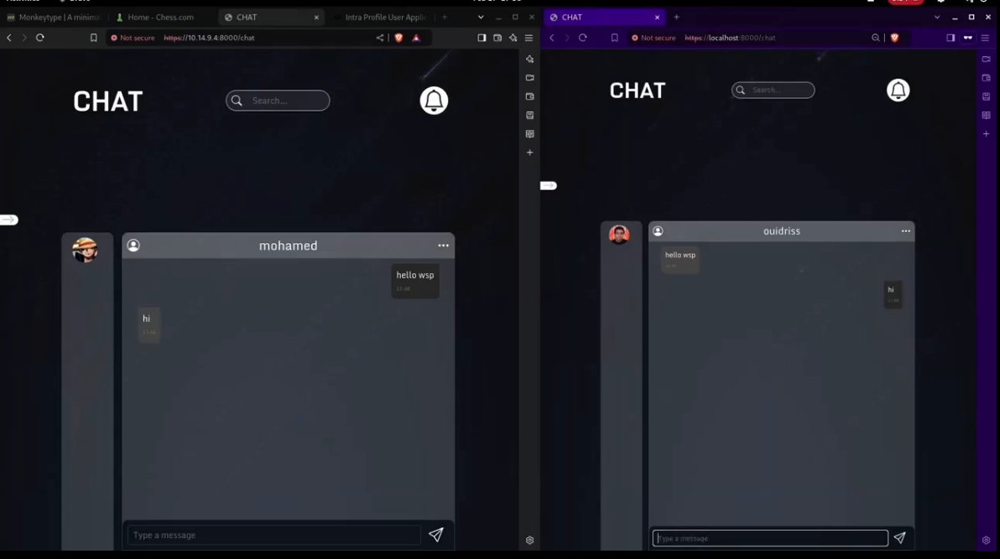
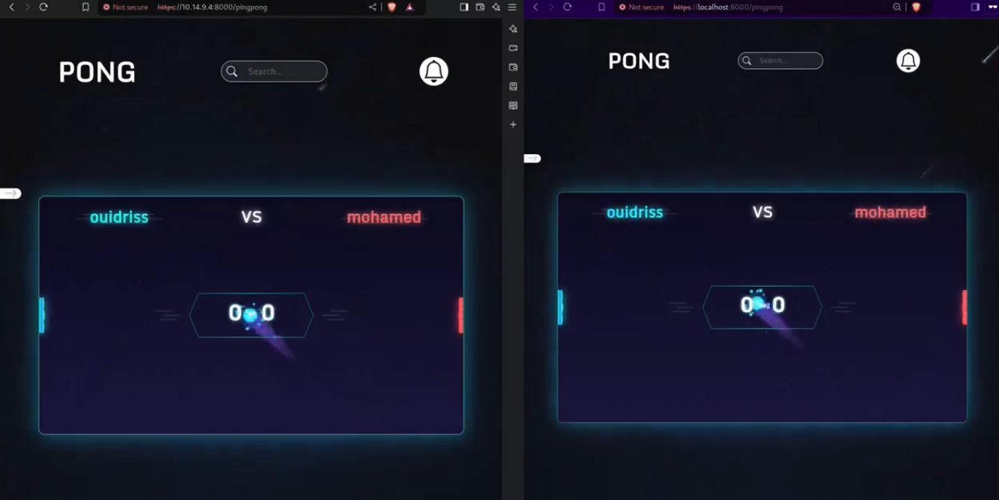

# 🧠 Transcendence (Django Version)

> A full-stack multiplayer gaming and social platform developed as part of the **1337/42 Network** curriculum.  
> This version utilizes a **Django backend** and a **vanilla JavaScript + HTML frontend**, featuring real-time chat, a Pong game, and user authentication.

---

## 🚀 Features

- 🔒 Authentication system with 2FA (optional)
- 🕹️ Real-time Pong game (multiplayer)
- 💬 Live Chat application (private & public rooms)
- 🧑‍🤝‍🧑 Friends system with status indicators
- 🌐 REST API & WebSocket support
- 🖼️ Clean and responsive UI (React + Tailwind)

---

## 📸 Preview

### 💬 Chat Interface

### 🕹️ Pong Game

---

## ⚙️ Technologies

- **Backend:** Django, Django Channels, DRF (Django REST Framework), Redis
- **Frontend:** HTML, CSS, Vanilla JavaScript
- **WebSockets:** For real-time chat and game updates
- **PostgreSQL:** Main database

---

## 🧑‍💻 Chat App Details

The chat feature includes:
- Real-time messaging using **Django Channels**
- Multiple room types (public, private, DM)
- User presence and message history
- Frontend WebSocket handling with React

> The chat module was built on top of the Django backend and connects seamlessly with user accounts and friend lists.

---

## 🕹️ Pong Game Details

The classic Pong game includes:
- Multiplayer via WebSockets
- Smooth animation loop
- Matchmaking logic
- Game state syncing between clients
## 🧩 Frontend Details

The frontend is crafted using:

- **HTML & CSS:** For structuring and styling the user interface
- **Vanilla JavaScript:** For dynamic interactions and real-time features
- **WebSocket Integration:** Enables real-time communication for chat and games
---
##  🧱 Microservices & Containerization:

This project follows a microservices architecture, where key features like authentication,
chat, game logic, and notifications are organized as independent services.
Each service is designed to be modular and isolated, enabling easier scalability, debugging, and deployment.
